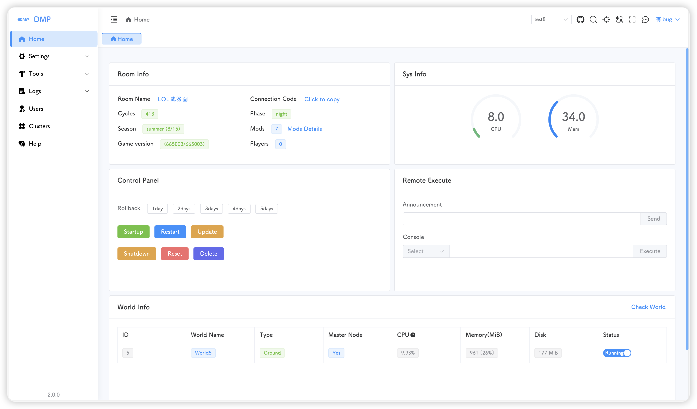
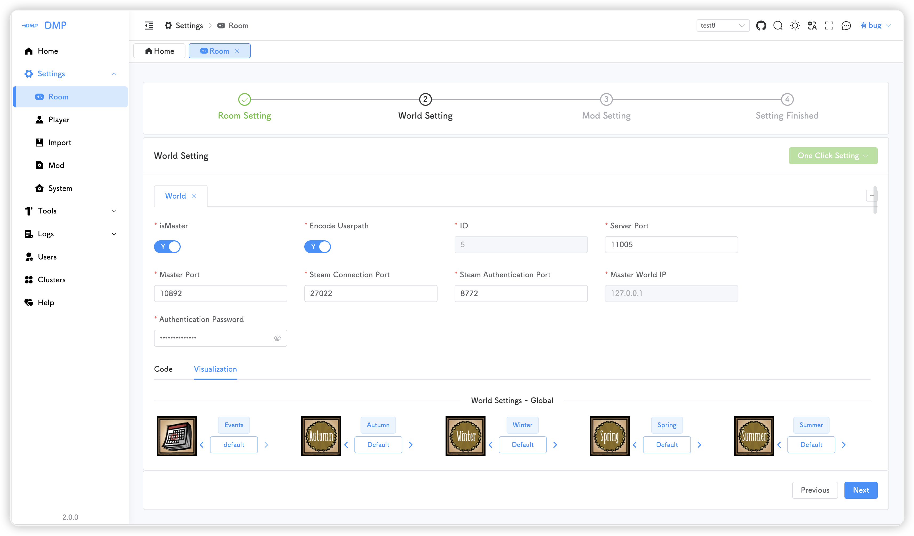
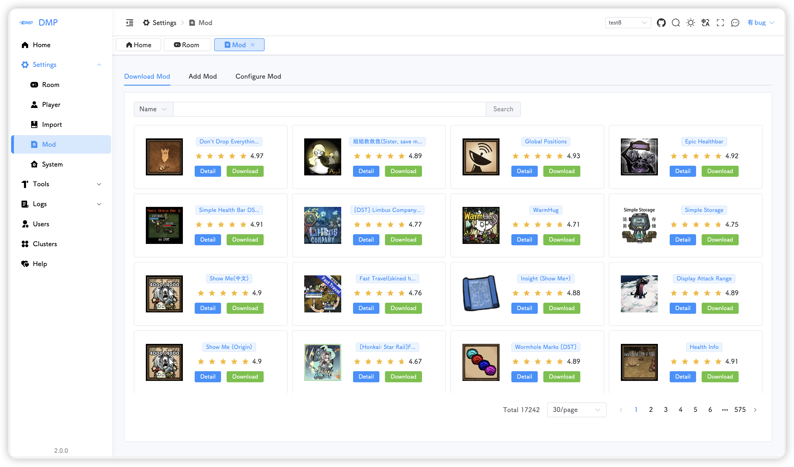
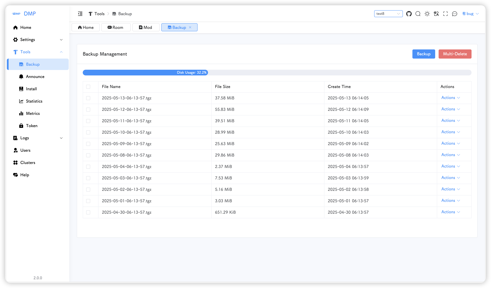
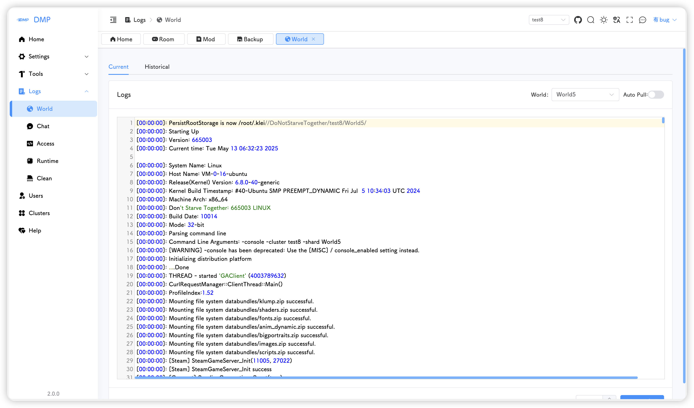

# [[中文文档]](../README.md) | [README]

## :warning: Version 2.x is NOT compatible with Version 1.x
>**Version 1.x will be discontinued in August 2025, after which features like mod search will no longer be available. Please upgrade to Version 2.x as soon as possible**

[Click to view the migration guide](README_migration_en.md)

## :watermelon: Usage
>**It is recommended to use the Ubuntu 24 system, as lower version systems may experience GLIBC version errors**
```shell
# Please execute the following command to download the script.
cd ~ && wget https://github.com/miracleEverywhere/dst-management-platform-api/raw/refs/heads/master/run.sh && chmod +x run.sh
```
```shell
# Customize the startup port.(Change 8082 to the port you want to use)，please change PORT manually, or
sed -i 's/^PORT=.*/PORT=8082/' run.sh
```
```shell
# According to the system prompts, enter the input and press Enter.
./run.sh
```
**Update**
```shell
cd ~ && ./run.sh
```
Input 4 according to the prompt
```shell
# root@VM-0-16-ubuntu:~# cd ~ && ./run.sh
饥荒管理平台(DMP)
--- https://github.com/miracleEverywhere/dst-management-platform-api ---
————————————————————————————————————————————————————————————
[0]: 下载并启动服务(Download and start the service)
————————————————————————————————————————————————————————————
[1]: 启动服务(Start the service)
[2]: 关闭服务(Stop the service)
[3]: 重启服务(Restart the service)
————————————————————————————————————————————————————————————
[4]: 更新管理平台(Update management platform)
[5]: 强制更新平台(Force update platform)
[6]: 更新启动脚本(Update startup script)
————————————————————————————————————————————————————————————
[7]: 设置虚拟内存(Setup swap)
[8]: 退出脚本(Exit script)
————————————————————————————————————————————————————————————
请输入选择(Please enter your selection) [0-8]:
```
If the release-version bin-file has been downloaded, execute the following command:
```shell
# The -c option is for enabling logging, it is recommended to enable it.
nohup ./dmp -c > dmp.log 2>&1 &
```
The default port is 80. If you wish to modify it, please modify the startup command:
```shell
# Change the port to 8888.
nohup ./dmp -c -l 8888 > dmp.log 2>&1 &
```
You can also specify the storage directory for the database file  
```shell
# Enable console output, listen on port 8899, and set the storage location of DstMP.sdb to ./config/DstMP.sdb
nohup ./dmp -c -l 8899 -s ./config > dmp.log 2>&1 &
```
**Docker deployment**  
First, obtain the Docker image tag from the package page  
It is recommended to map the config、dst and .klei directories
```shell
# bind port 80, and map directories to /app
docker run -itd --name dmp -p 80:80 \
-v /app/config:/root/config \
-v /app/dst:/root/dst \
-v /app/.klei:/root/.klei \
-v /app/dmp_files:/root/dmp_files \
-v /app/steamcmd:/root/steamcmd \
-v /etc/localtime:/etc/localtime:ro \
-v /etc/timezone:/etc/timezone:ro \
ghcr.io/miracleeverywhere/dst-management-platform-api:latest
```
```shell
# bind port 8000, and map directories to /app
docker run -itd --name dmp -p 8000:80 \
-v /app/config:/root/config \
-v /app/dst:/root/dst \
-v /app/.klei:/root/.klei \
-v /app/dmp_files:/root/dmp_files \
-v /app/steamcmd:/root/steamcmd \
-v /etc/localtime:/etc/localtime:ro \
-v /etc/timezone:/etc/timezone:ro \
ghcr.io/miracleeverywhere/dst-management-platform-api:latest
```
```shell
# bind port 8000, use host network, and map directories to /app
docker run -itd --name dmp --net=host \
-e DMP_PORT=8080 \
-v /app/config:/root/config \
-v /app/dst:/root/dst \
-v /app/.klei:/root/.klei \
-v /app/dmp_files:/root/dmp_files \
-v /app/steamcmd:/root/steamcmd \
-v /etc/localtime:/etc/localtime:ro \
-v /etc/timezone:/etc/timezone:ro \
ghcr.io/miracleeverywhere/dst-management-platform-api:latest
```
**Docker image update**  
Stop the old version container, pull the new version image, and start using the above command.  
If the config, dst, and .klei directories are mapped, there is no need to reinstall the game or perform other operations.  

**MacOS Installation(Beta Version - No Official Support)**
> Only supports Mac with M-series CPUs.
```shell
cd ~ && wget https://github.com/miracleEverywhere/dst-management-platform-api/raw/refs/heads/master/run_macos.sh && chmod +x run_macos.sh && ./run_macos.sh
# 请输入需要执行的操作(Please enter the operation to be performed): 
# [0]: 下载并启动服务(Download and start the service) 
# [1]: 启动服务(Start the service) 
# [2]: 关闭服务(Stop the service) 
# [3]: 重启服务(Restart the service) 
# [4]: 更新服务(Update the service) 
```
Enter 0 to download and start, after startup is complete, run the manual_install.sh script to install the game, cannot install on the page
```shell
./manual_install.sh
```
>Note: Due to system limitations on macOS, mod configuration is temporarily unavailable. You need to click the “Export” button on the Settings > Mods > Add Mods page. After clicking, a directory named dmp_exported_mod will be generated on the desktop. Users must use **Finder** to copy the mods from this directory to the ~/dst/dontstarve_dedicated_server_nullrenderer/Contents/mods directory. To update a mod, you need to delete the corresponding mod on the Settings > Mods > Add Mods page, then re-download the mod, perform the export and copy operations, and restart the game server
---

## :grapes: Default username and password
>After logging in, please change your password on username-profile page as soon as possible
>
>>Default username and password: 
>>admin/123456

---

## :cherries: DMP screenshot















---

##  :sparkling_heart: Thanks
The [front-end page](https://github.com/miracleEverywhere/dst-management-platform-web) of this project is based on the secondary development of **koi-ui**, thanks to open source  
[[koi-ui gitee]](https://gitee.com/BigCatHome/koi-ui)  
[[koi-ui github]](https://github.com/yuxintao6/koi-ui)  
